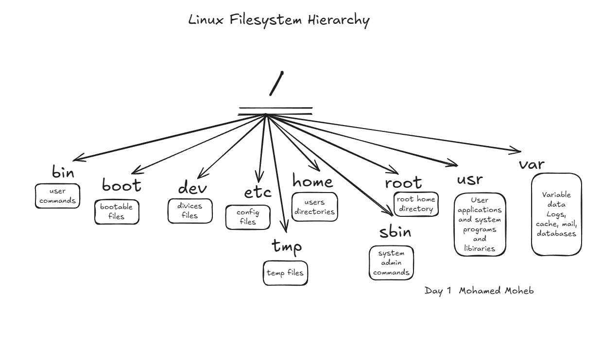

Today is great I get to know more of commands about the system health 
like 
1. df -h >> to know the disk usage and -h is for human readable 
2. free -h >> to know more about memory 
3. whoami >> to know the loged users 
4. uptime >> for CPU load 
5. ss -tulnp >> to know about the port opened and who is using it

also today i get to know how to use variables in bash and to make a file exutable and the best practice for 
a bash script by using set -euo pipefail So if there is a problem apperes 

also i get to know the linux directories and every function of them and this is my drawing of it  

